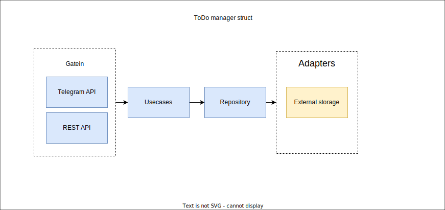

# ToDo manager

Is a simple application for personal task management.  
One user - one todo list. Tasks may be created and mark as done. Tasks can not be modified
or deleted.

# Entrypoints
## WEB
Application have simple REST API
## Telegram
Application can be configurated with enable Telegram bot entrypoint
Telegram bot need os envoriement variable "TELEGRAM_TOKEN"

## Application struct

## Configuration
### WEB API 
- enable: bool
- enableRegistration: bool
- port: int
### Telegram bot
- ebable : bool
- enableRegistration: bool